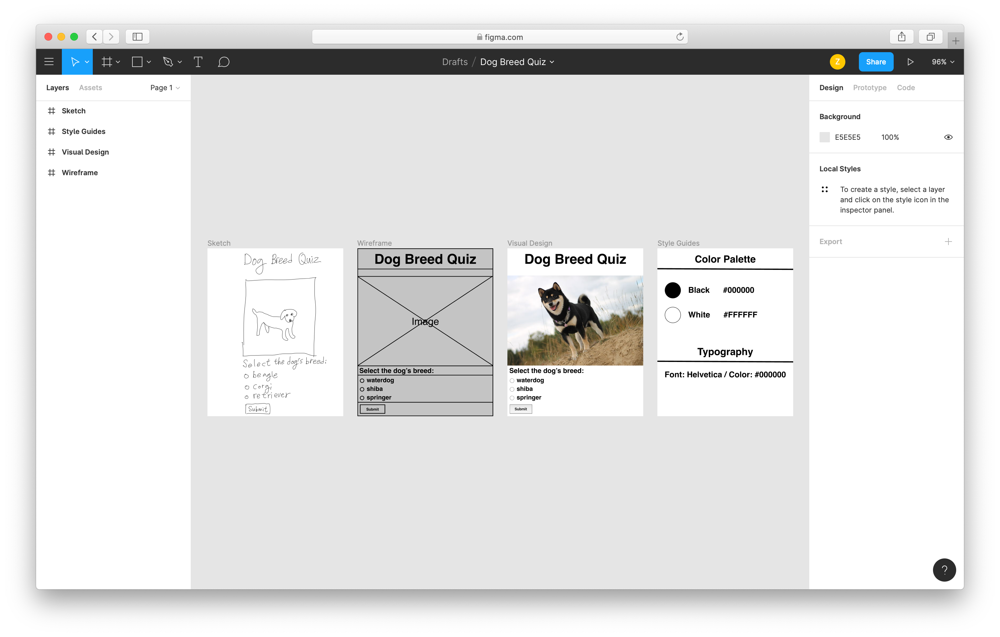
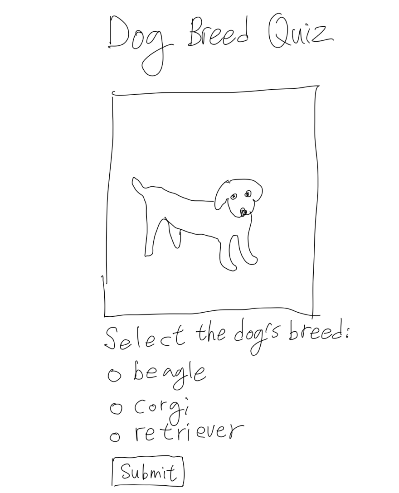
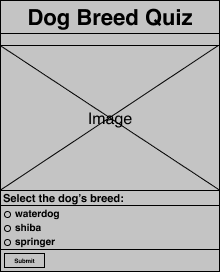
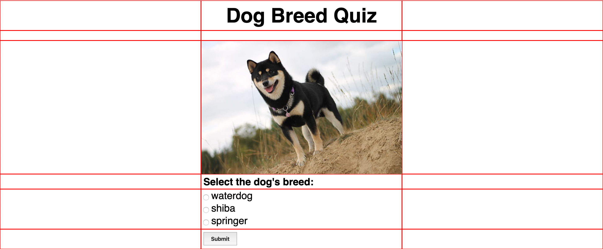
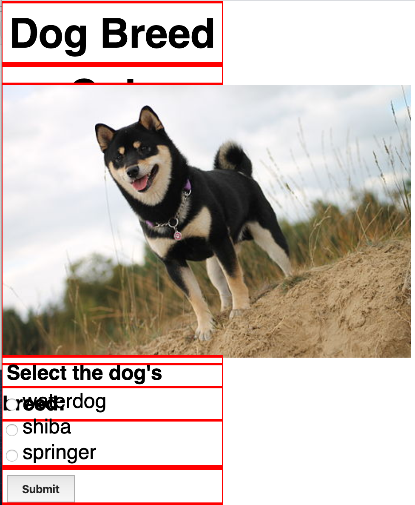

# Dog Breed Quiz
This is the week 3 assignment for the ITP class Dynamic Web Development.<br />
This week, the assignment was to created a dynamic front end web application. This means that it must:

* Connect with an API (e.g. weather, time)
* Include an interactive element that responds to an event (e.g. click, scroll, mouseover, etc.)
* Be responsive to the screen size

[Live Demo on Glitch](https://cuinjune-dog-breed-quiz.glitch.me/)

## Design
I started with drawing a rough sketch to determine how the contents should be placed and then I used [Figma](https://www.figma.com/file/4tPv71U0E7AkBKHCRknwd4/Dog-Breed-Quiz?node-id=0%3A1) to create wireframe, visual design, and style guide. 


### Sketch


### Wireframe


### Visual Design


### Style Guides


## Building the Website
I structured the HTML page with flex boxes that are essentially made of rows and columns and based on the wireframe sketch.



I tried to make the page responsive to the page size by changing the flex-direction.

```
@media screen and (max-width: 800px) {
    .row1 {
        flex-direction: column;
    }
}
```
But it didn't seem to work properly for some reason. I need to ask and learn how to fix this.



## Author
* [Zack Lee](https://www.cuinjune.com/about): an MPS Candidate at [NYU ITP](https://itp.nyu.edu)
